# GPU Workloads on Nomad

> This repository manages a HashiCorp Nomad cluster on Azure with GPU support, mixed Linux/Windows workloads, and automatic scaling.

## Table of Contents

<!-- TOC -->
* [GPU Workloads on Nomad](#gpu-workloads-on-nomad)
  * [Table of Contents](#table-of-contents)
  * [Requirements](#requirements)
  * [Diagrams](#diagrams)
    * [Architecture](#architecture)
  * [Usage](#usage)
    * [Inputs](#inputs)
    * [Outputs](#outputs)
  * [Endpoints](#endpoints)
  * [Notes](#notes)
    * [GPU Quota](#gpu-quota)
    * [Sensitive Data](#sensitive-data)
  * [Contributors](#contributors)
  * [License](#license)
<!-- TOC -->

## Requirements

* Azure [Subscription](https://portal.azure.com)
* HashiCorp Terraform `1.14.x` or [newer](https://developer.hashicorp.com/terraform/downloads)

## Diagrams

This section contains an overview of (simplified) diagrams, describing the architecture of the Nomad cluster.
All diagrams are expressed in [Mermaid](https://mermaid.js.org) syntax.

### Architecture

This diagram describes the cluster topology, networking, and workload placement:

```mermaid
graph TB
    subgraph Internet
        User([User / Player])
    end

    subgraph Azure["Azure (Resource Group: nomad-gpu)"]

        subgraph Networking["Networking"]
            PIP[Public IP]
            NAT[NAT Gateway]
            Bastion[Azure Bastion]
        end

        subgraph PublicLB["Public Load Balancer"]
            LB80[":80 HTTP"]
            LB8080[":8080 Traefik Dashboard"]
            LB4646[":4646 Nomad API"]
            LB25565[":25565 Minecraft Java"]
            LB19132[":19132/udp Minecraft Bedrock"]
        end

        subgraph VNet["VNet 10.0.0.0/16"]

            subgraph Subnet["VMSS Subnet 10.0.1.0/24"]

                subgraph LinuxVMSS["Linux VMSS (Ubuntu 24.04)"]
                    subgraph Servers["Nomad Servers (instances 0-2)"]
                        S1[Server 1]
                        S2[Server 2]
                        S3[Server 3]
                    end

                    subgraph Clients["Nomad Clients (instances 3+)"]
                        direction TB
                        GPU["NVIDIA GPU Driver (optional N-series)"]
                        NvidiaPlugin["nomad-device-nvidia"]
                        Podman["Podman + NVIDIA Container Toolkit"]

                        subgraph LinuxJobs["Linux Workloads"]
                            Traefik["Traefik (system job)\n:80 :8080"]
                            Ollama["Ollama\nLLM Inference"]
                            Docling["Docling\nDocument AI\n(autoscaled 1-3)"]
                            MCJava["Minecraft Java\n:25565"]
                            Autoscaler["Nomad Autoscaler"]
                        end
                    end
                end

                ILB["Internal LB\n10.0.1.10\n:4647 :4648"]

                subgraph WindowsVM["Windows VM (Server 2025)"]
                    WinNomad["Nomad Client\nnode_class=windows"]
                    IISDriver["nomad-iis driver"]
                    RawExec["raw_exec driver"]
                    JavaJRE["OpenJDK 21 JRE"]

                    subgraph WinJobs["Windows Workloads"]
                        IIS["IIS Web Server"]
                        MCBedrock["Minecraft Bedrock\n:19132/udp"]
                    end
                end
            end
        end

        LogAnalytics["Log Analytics\n+ Azure Monitor"]
        Storage["Storage Account\nBoot Diagnostics"]
    end

    %% Internet to LB
    User --> PIP
    PIP --> PublicLB

    %% LB to backends
    LB80 --> Traefik
    LB8080 --> Traefik
    LB4646 --> Servers
    LB25565 --> MCJava
    LB19132 --> MCBedrock

    %% Traefik routing
    Traefik -. "/iis" .-> IIS
    Traefik -. "/ollama" .-> Ollama
    Traefik -. "/" .-> Docling

    %% Internal LB for Windows server discovery
    ILB --> Servers
    WinNomad --> ILB

    %% GPU stack
    GPU --> NvidiaPlugin
    NvidiaPlugin --> Podman
    Podman --> LinuxJobs

    %% Outbound
    LinuxVMSS --> NAT
    WindowsVM --> NAT
    NAT --> Internet

    %% Monitoring
    LinuxVMSS -.-> LogAnalytics
    WindowsVM -.-> LogAnalytics
    LinuxVMSS -.-> Storage
    WindowsVM -.-> Storage

    %% Autoscaler targets
    Autoscaler -. "scale jobs" .-> Servers
    Autoscaler -. "scale VMSS" .-> LinuxVMSS

    %% Bastion
    Bastion -. "SSH/RDP" .-> Subnet

    %% Styles
    classDef gpu fill:#76b900,stroke:#333,color:#fff
    classDef windows fill:#0078d4,stroke:#333,color:#fff
    classDef linux fill:#e95420,stroke:#333,color:#fff
    classDef lb fill:#f5a623,stroke:#333,color:#fff
    classDef monitoring fill:#666,stroke:#333,color:#fff

    class GPU,NvidiaPlugin,Podman gpu
    class WindowsVM,WinNomad,IISDriver,RawExec,JavaJRE,IIS,MCBedrock windows
    class LinuxVMSS,Servers,Clients,S1,S2,S3 linux
    class PublicLB,ILB,LB80,LB8080,LB4646,LB25565,LB19132 lb
    class LogAnalytics,Storage monitoring
```



## Usage

To inject sensitive _"Secret Zero"_ type data, the [1Password CLI](https://1password.com/downloads/command-line/) is used to wrap common Terraform commands (`plan`, `apply`, `destroy`).

This repository provides a [Taskfile](./Taskfile.yml)-based workflow.

<!-- BEGIN_TF_DOCS -->
### Inputs

| Name | Description | Type | Required |
|------|-------------|------|:--------:|
| azurerm_subscription_id | Azure Subscription ID. | `string` | yes |
| azurerm_bastion_sku | SKU for Azure Bastion. Use Standard for native tunneling (SSH/RDP via az cli), Basic for portal-only access. | `string` | no |
| azurerm_bastion_subnet_address_prefix | Address prefix for Azure Bastion subnet. | `string` | no |
| azurerm_ingress_ports | TCP destination ports opened in the VMSS NSG for external ingress. UDP ports (e.g. 19132 for Minecraft Bedrock) are handled by dedicated rules. | `list(string)` | no |
| azurerm_ingress_source_addresses | Source IP addresses (CIDR) allowed to reach ingress ports. Defaults to the current public IP of the Terraform runner if not set. | `list(string)` | no |
| azurerm_location | The Azure Region where the Resource Group should exist. | `string` | no |
| azurerm_sas_token_expiry | Duration for storage account SAS token validity (e.g. 24h, 48h, 168h). | `string` | no |
| azurerm_vmss_admin_username | Admin username for the Linux VM scale set instances. | `string` | no |
| azurerm_vmss_gpu_enabled | Whether to create a dedicated GPU VMSS alongside the main VMSS. | `bool` | no |
| azurerm_vmss_gpu_instance_count | Number of GPU VM instances in the GPU scale set. | `number` | no |
| azurerm_vmss_gpu_sku | VM size for the GPU scale set instances (must be N-series for GPU support). | `string` | no |
| azurerm_vmss_install_nvidia_gpu_extension | Install NVIDIA GPU driver extension on the main (non-GPU) VMSS instances. | `bool` | no |
| azurerm_vmss_linux_instance_count | Number of Linux VM instances in the scale set. | `number` | no |
| azurerm_vmss_linux_source_image_reference | Source image reference for the Linux VM scale set. | <pre>object({<br/>    publisher = string<br/>    offer     = string<br/>    sku       = string<br/>    version   = string<br/>  })</pre> | no |
| azurerm_vmss_nvidia_gpu_extension_version | Version of the NVIDIA GPU driver extension for VMSS. | `string` | no |
| azurerm_vmss_sku | VM size for the scale set instances. | `string` | no |
| azurerm_vmss_subnet_address_prefix | The address prefixes to use for the subnet. | `string` | no |
| azurerm_vmss_zones | Availability zones for the VMSS (e.g. ["1", "2", "3"]). Requires a zone-capable region. Set to [] to disable. | `list(string)` | no |
| azurerm_vnet_address_space | The address space that is used by the virtual network. | `list(string)` | no |
| azurerm_windows_admin_username | Admin username for the Windows VM. | `string` | no |
| azurerm_windows_instance_count | Number of standalone Windows VMs (Nomad clients). Set to 0 to disable. | `number` | no |
| azurerm_windows_source_image_reference | Source image reference for the Windows VM. | <pre>object({<br/>    publisher = string<br/>    offer     = string<br/>    sku       = string<br/>    version   = string<br/>  })</pre> | no |
| azurerm_windows_vm_size | VM size for the Windows instance. | `string` | no |
| java_jre | Adoptium Temurin JRE version, SHA256 checksum, and archive filename for Windows x64. | <pre>object({<br/>    version  = string<br/>    sha256   = string<br/>    filename = string<br/>  })</pre> | no |
| log_analytics_retention_days | Number of days to retain logs in Log Analytics workspace. | `number` | no |
| nomad_acl_enabled | Toggle to enable Nomad ACLs. | `bool` | no |
| nomad_datacenter | Nomad datacenter name used in all agent configs. | `string` | no |
| nomad_iis_version | Version of the nomad-iis task driver plugin for Windows clients. | `string` | no |
| nomad_plugin_versions | Versions of Nomad plugins installed on Linux VMSS instances. | <pre>object({<br/>    device_nvidia = string<br/>    driver_exec2  = string<br/>    autoscaler    = string<br/>  })</pre> | no |
| nomad_server_count | Number of VMSS instances that run as Nomad servers (first N by instance ID). Use 3 or 5 for production quorum. | `number` | no |
| nomad_version_windows | Nomad version to install on Windows clients. | `string` | no |
| project_identifier | Project Identifier. | `string` | no |
| tags | Tags applied to all Azure resources. | `map(string)` | no |

### Outputs

| Name | Description |
|------|-------------|
| gpu_ssh_via_bastion_list_instances | List actual GPU VMSS instance IDs for use with gpu_ssh_via_bastion_template |
| gpu_ssh_via_bastion_template | SSH command template for GPU VMSS — replace <INSTANCE_ID> with actual ID from gpu_ssh_via_bastion_list_instances |
| internal_load_balancer_ip | Private IP of the internal load balancer used for Nomad server discovery |
| load_balancer_endpoints | Remote access URLs for services behind the load balancer |
| load_balancer_public_ip | Public IP of the load balancer for HTTP (80) and Nomad API (4646) |
| private_key_openssh | n/a |
| ssh_via_bastion_list_instances | List actual VMSS instance IDs for use with ssh_via_bastion_template |
| ssh_via_bastion_template | SSH command template — replace <INSTANCE_ID> with actual ID from ssh_via_bastion_list_instances |
| windows_admin_password | Admin password for Windows VM instances |
<!-- END_TF_DOCS -->

## Endpoints

| Service | URL |
|---------|-----|
| Traefik HTTP | `http://<public-ip>` |
| Traefik Dashboard | `http://<public-ip>:8080` |
| IIS (via Traefik) | `http://<public-ip>/iis` |
| Ollama (via Traefik) | `http://<public-ip>/ollama` |
| Docling (via Traefik) | `http://<public-ip>/` |
| Nomad API / UI | `http://<public-ip>:4646` |
| Minecraft Java | `<public-ip>:25565` |
| Minecraft Bedrock | `<public-ip>:19132` (UDP) |

Run `terraform output load_balancer_endpoints` to get the actual URLs.

## Notes

### GPU Quota

The GPU VMSS (`var.azurerm_vmss_gpu_enabled = true`) requires N-series VM quota, which is **zero by default** on most Azure subscriptions. You must request an increase before `terraform apply` will succeed.

#### Check current quota

```bash
az vm list-usage --location <region> -o table | grep "NCASv3_T4"
```

#### Request quota increase via CLI

First, register the quota provider (one-time):

```bash
az provider register --namespace Microsoft.Quota
az provider show -n Microsoft.Quota --query "registrationState"  # wait for "Registered"
```

Find the exact resource name for your GPU family:

```bash
az quota list \
  --scope "/subscriptions/<subscription-id>/providers/Microsoft.Compute/locations/<region>" \
  --query "[?contains(name, 'T4')]" -o table
```

Request the increase (4 vCPUs for a single `Standard_NC4as_T4_v3`):

```bash
az quota create \
  --resource-name "Standard NCASv3_T4 Family" \
  --scope "/subscriptions/<subscription-id>/providers/Microsoft.Compute/locations/<region>" \
  --limit-object value=4 \
  --resource-type dedicated
```

#### Request quota increase via Azure Portal

1. Go to **Subscriptions** > your subscription > **Usage + quotas**
2. Search for the GPU family (e.g. `NCASv3_T4`)
3. Select the region and click **Request increase**
4. Set the new limit (e.g. 4 vCPUs) and submit

Approval is typically instant for small requests, but may take up to 72 hours.

### Sensitive Data

Terraform state may contain [sensitive data](https://developer.hashicorp.com/terraform/language/state/sensitive-data). This configuration uses local state by default. Consider using a [remote backend](https://developer.hashicorp.com/terraform/language/backend) to safely store state and encrypt the data at rest.

## Contributors

For a list of current (and past) contributors to this repository, see [GitHub](https://github.com/ksatirli/gpu-workloads-on-nomad/graphs/contributors).

## License

Licensed under the Apache License, Version 2.0 (the "License").

You may download a copy of the License at [apache.org/licenses/LICENSE-2.0](http://www.apache.org/licenses/LICENSE-2.0).

See the License for the specific language governing permissions and limitations under the License.
